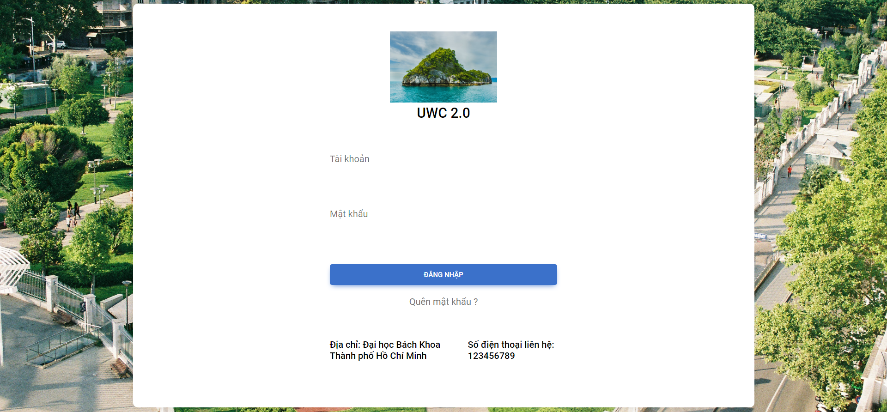
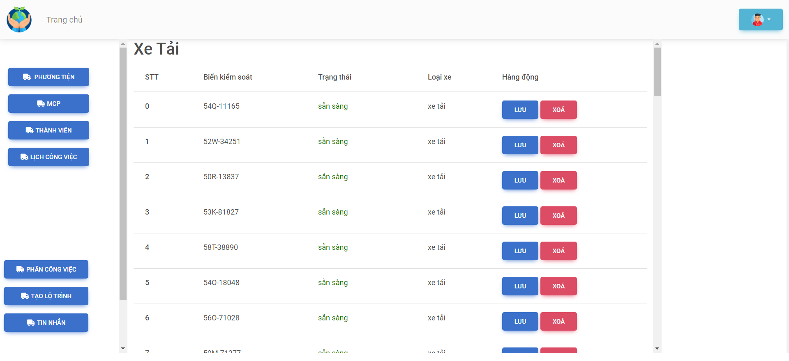
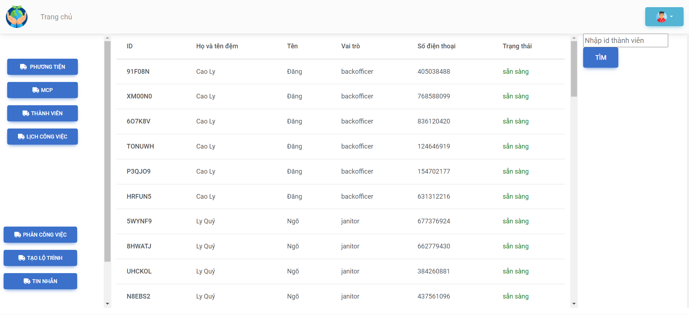
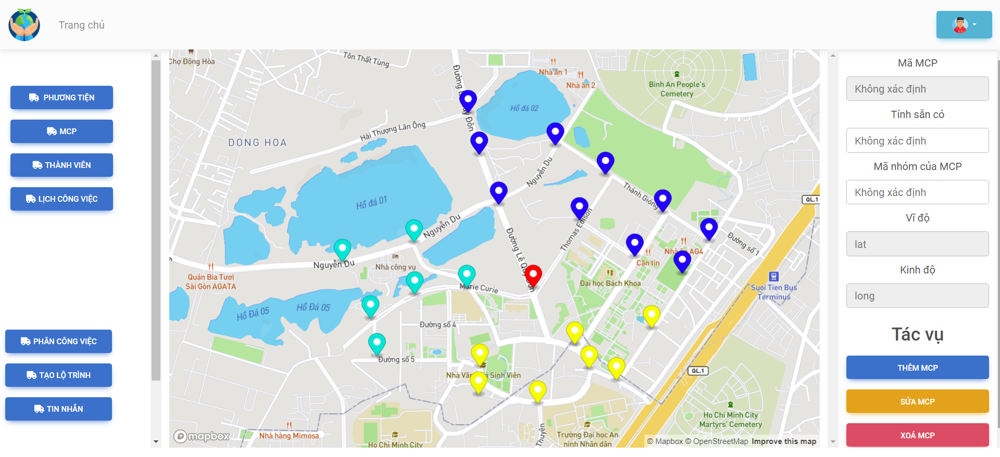
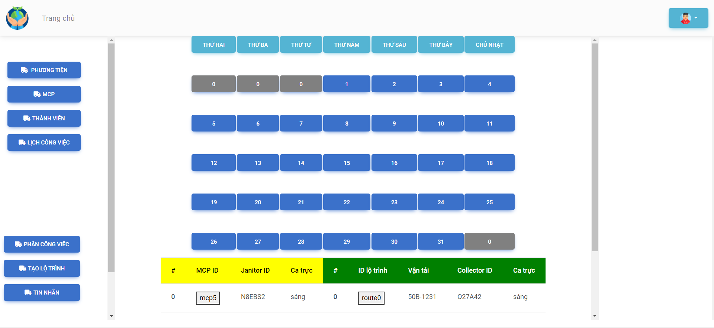
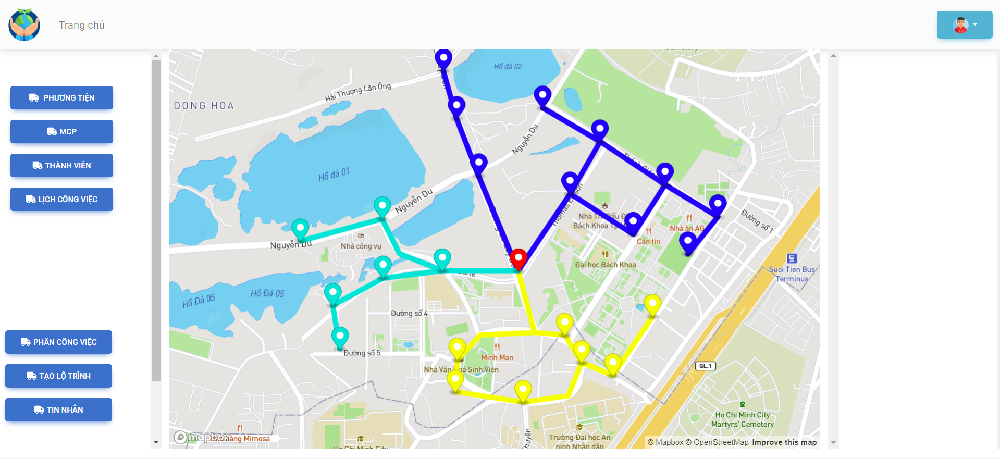
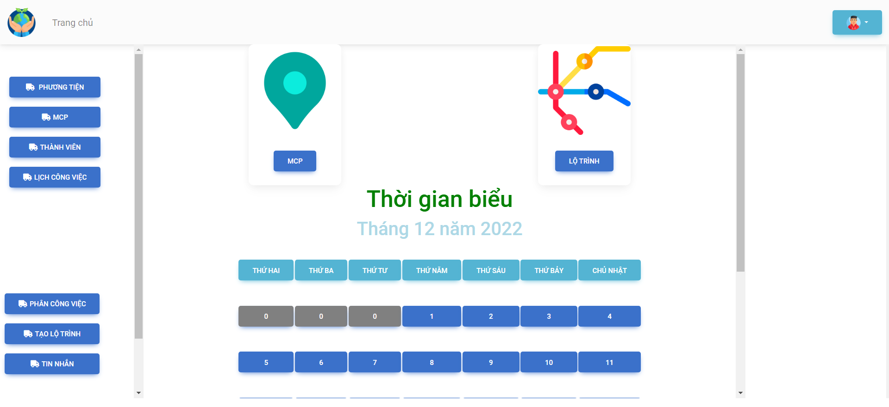
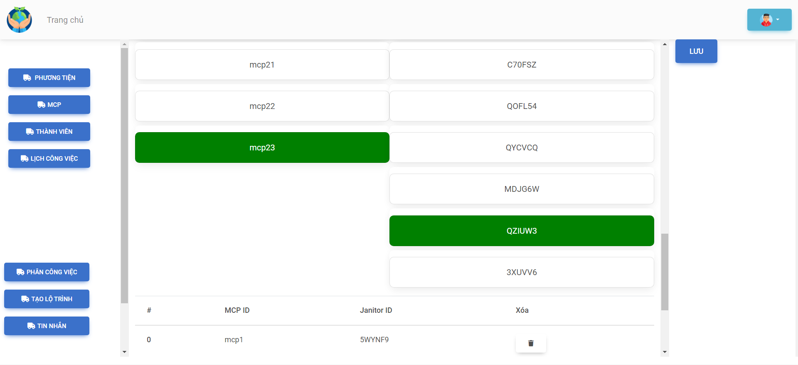
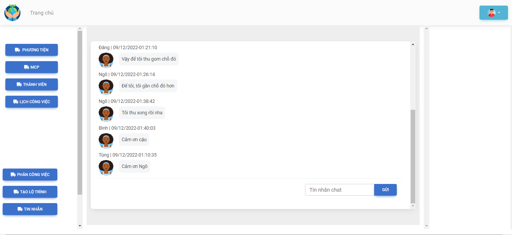
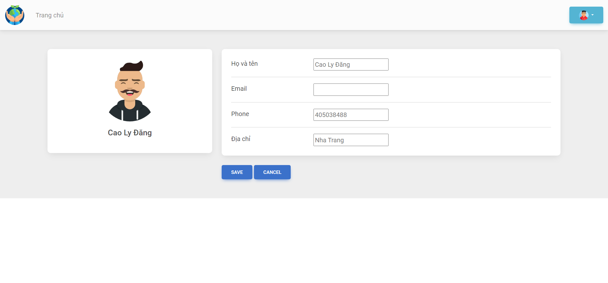

<h1 style="text-align:center;">UWC 2.0</h1>

## Information details
<ul>
  <li>Subject name: Software engineering</li>
  <li>Description: A system for environment management company</li>
  <li>Year: 2022</li>
  <li>Member:
  <ol>
    <li>Doan Tran Cao Tri (Leader)</li>
    <li>Nguyen Tien Manh</li>
    <li>Ha Vinh Nguyen</li>
    <li>Tran Minh Nghia</li>
    <li>Pham Dinh Van</li>
    <li>Pham Minh Tu</li>
    <li>Tran Tien Dat</li>
  </ol>
  </li>
</ul>

## Setup

1. Install requirements.txt
```bash
pip install -r requirements.txt
```
2. Run app.py

## Project Information
1. Language and technology: Python, Flask Framework
2. Database: Hardcode

## UI
<div style="text-align:center">

<p>Sign in</p>
</div>
<ol>
    <li>BackOffice role: username: backofficer, password: backofficer</li>
    <li>Janitor role: username: janitor, password: janitor</li>
    <li>Collector role: username: collector, password: collector</li>
</ol>

<div style="text-align:center">

<p>Vehicle Management</p>
</div>
<ol>
    <li>Get information about: plate, state, kind</li>
    <li>Some operator: edit, delete and add new vehicle</li>
</ol>

<div style="text-align:center">

<p>Employee Management</p>
</div>
<ol>
    <li>Get information about: self-information, state: ready or busy</li>
    <li>Some operator: find employee by id or name</li>
</ol>

<div style="text-align:center">

<p>MCP Management</p>
</div>
<ol>
    <li>MCP: a place where a group of janitor will collect garbage</li>
    <li>Using <b>Mapbox API</b></li>
    <li>Get information about: mcp position, capacity</li>
    <li>Some operator: move, delete and add new mcp</li>
</ol>

<div style="text-align:center">

<p>Schedule Overview</p>
</div>
<ol>
    <li>Backofficer can overview employee working and theirs schedules in current month and a next month</li>
</ol>

<div style="text-align:center">

<p></p>
</div>
<ol>
    <li>Backofficer can click a button to run an algorithm <b>Minimum Spanning Tree</b> for generating optimized routes which can collect all "overload" mcp</li>
</ol>

<div style="text-align:center">


<p></p>
</div>
<ol>
    <li>In task assignment: BO can assign janitor to mcp or assign collector to vehicle</li>
    <li>BO will select janitor's id and mcp's id as a pair and then click 'save'</li>
</ol>

<div style="text-align:center">

<p>Group Chat</p>
</div>

<div style="text-align:center">

<p>Personal Information Management</p>
</div>
<ol>
    <li>Each employee (include Backofficer) can modify their information</li>
</ol>
